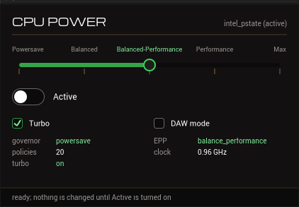

# CPU-Power

A small window for Linux CPU frequency scaling and power settings.
No GTK, no Qt, no systemd, **no password**.



One top-level X11 window painted by hand with Cairo and FreeType: a five-stop slider, a
master toggle, and two checkboxes. It sets the scaling governor, the energy/performance
preference, the frequency limits, turbo, and the system's C-state exit latency limit — and
it puts all of them back when you turn it off.

## Why

A machine that boots with the `powersave` governor is doing the right thing most of the
time and the wrong thing for the hour you spend rendering, compiling or tracking audio.
Fixing that by hand means `su`, remembering which of five different attribute names your
running driver actually has, echoing into `sysfs`, and remembering to undo it afterwards.

This is that, in a window, correctly, and reversibly.

**Off means the machine is exactly as the kernel left it.** That is the whole safety
property, and it is what makes the tool safe to try. Turning the master toggle off
restores. So does closing the window. So does the program being killed — the privileged
helper puts everything back when its input closes, and closing that input is something
`SIGKILL` cannot prevent. There is no path that depends on an orderly shutdown.

## What it sets

| Control | What it does |
|---|---|
| **The slider** | Five named stops — Powersave, Balanced, Balanced-Performance, Performance, Maximum |
| **Active** | The master toggle. Off restores; nothing runs as root until it is on |
| **Turbo** | Whether the CPU may clock above its rated base frequency |
| **DAW mode** | Caps C-state exit latency, for audio work |

The stops are **named rather than numbered** because the kernel's power knobs are
enumerations. `ondemand` is not a number and there is no continuum between it and
`schedutil`, so a 0–100% slider would be a lie on most machines. Each stop is a
*preference-ordered wish*, resolved against what the running driver actually offers — and
the window always shows the **resolved** outcome, so a stop that collapses into its
neighbour on your hardware is visible rather than a silent no-op.

**DAW mode is not a speed setting**, and no governor setting substitutes for it. A 64-sample
buffer at 48 kHz is a 1333 µs period. Waking a core from a deep C-state can cost 680 µs of
that — and the slider makes it *worse*, because a faster core finishes its block earlier,
idles longer, and lets the kernel pick a deeper state. DAW mode holds `/dev/cpu_dma_latency`
open at **the smallest non-zero exit latency your machine reports**: the shallowest state
that still actually halts the core. It does not request zero, which would admit only the
POLL pseudo-state and leave every core spinning for no benefit at all. Because the kernel
drops the constraint when the last descriptor closes, DAW mode cannot get stuck on.

## Installing

Build dependencies: a C and C++17 compiler, CMake ≥ 3.16, and the development packages for
`cairo`, `cairo-ft`, `cairo-xlib`, `freetype2`, `fontconfig` and `x11`. At run time you want
`polkit` — the tool works without it, but that is the path that needs no password.

```sh
cmake -S . -B build -DCMAKE_BUILD_TYPE=Release -DCMAKE_INSTALL_PREFIX=/usr
cmake --build build
sudo cmake --install build
```

**Use `-DCMAKE_INSTALL_PREFIX=/usr`, or read the next paragraph.** polkit reads action files
from exactly two directories — `/usr/share/polkit-1/actions` and `/etc/polkit-1/actions` —
and nowhere else. A prefix such as `~/.local` puts the action somewhere polkitd will never
look, and **the failure is silent**: the tool still runs, and merely starts asking for an
administrator password it was never meant to ask for. The build warns at configure time when
the action directory is not one of those two, and you can override it on its own with
`-DCPUPOWER_POLKIT_ACTIONDIR=/usr/share/polkit-1/actions`.

The install places two binaries — the GUI and the privileged helper — plus the polkit action
that says who may run the helper, the fonts the window is lettered in, the icon theme entries,
a desktop entry and a manual page. **It sets no setuid or setgid bit**, and a test asserts
that.

## How it reaches root

The window is **never root and never setuid**, and this project **handles no password at
all**. Exactly one program runs as root — `cpu-power-helper`, a few hundred lines of plain C
with no libraries — and it is reached by the least intrusive route available:

| | Route | What it needs |
|---|---|---|
| 1 | already root | nothing |
| 2 | **`pkexec`** | polkit *already* saying yes to the installed action — **no prompt at all** |
| 3 | — | fails, saying what to do about it |

**There is one way in and no fallback.** Not "pkexec is installed" — *polkit already says yes*.
Before using `pkexec`, the program asks `pkcheck` whether the action will be authorised with no
interaction at all, and proceeds only on an unqualified yes. That check is what makes "no
password" true rather than merely intended: a missing or unparseable action does **not** make
`pkexec` fail. It makes it fall back to `org.freedesktop.policykit.exec`, whose defaults are
`auth_admin`, and your desktop's polkit agent turns that into a root password dialog. The
pre-flight question cannot itself prompt, because `--allow-user-interaction` is never passed.

So on a machine with no polkit, the tool says so and stops:

```
cannot reach the privileged helper, and this program will never run itself as root.
pkexec is installed, but polkit would not authorise io.github.rations.cpu-power without asking
for a password, so it was not used -- this program never asks for one.
```

**There used to be a `sudo -n` fallback. It was deleted rather than repaired.** It served machines
without polkit, where the remedy is installing one package, and what it cost was a second
privilege path with *different properties* from the first: a `sudoers` grant is not limited to the
person at the machine, so it also reaches that user over SSH and from anything they can start. It
also needed a worked `NOPASSWD` example to be used safely, and an example of a root grant is the
kind of thing people copy without reading. One door is a better security story than two doors with
different locks — and a much shorter one to explain.

Deleting it removed two live bugs nobody had ever hit, because the rung had never actually run: a
capability probe that `sudoers(5)` says could not work for a narrow rule, and a ladder that never
fell through to it.

### Who is allowed

The installed action's defaults are `allow_any=no`, `allow_inactive=no`, `allow_active=yes`.
That triple says the one thing `sudo` cannot: **is this person physically at this machine
right now?** Adjusting your own CPU is a preference, not an administrative act, and every
desktop settings panel already treats it as one.

Measured on the development machine (Devuan 6, elogind, polkit 126) with
`pkcheck --action-id io.github.rations.cpu-power --process $$`:

| Situation | `Active` | `Remote` | Result | |
|---|---|---|---|---|
| Logged in at the screen | `yes` | `no` | **authorised, no prompt** | measured |
| The same, under `setsid` | `yes` | `no` | **authorised, no prompt** | measured |
| *Control:* `org.freedesktop.policykit.exec` from that same session | — | — | *"Authorization requires authentication"* | measured |
| A session switched away to another VT | `no` | `no` | denied by `allow_inactive=no` | by construction |
| Another user logged in while you are at the screen | `no` | `no` | denied by `allow_inactive=no` | by construction |
| A remote login | — | `yes` | denied by `allow_any=no` | by construction |

The control row is the important one. `org.freedesktop.policykit.exec` is what `pkexec` falls
back to when our action does not match, and from the very session that is silently authorised
for our action it demands authentication instead. That is simultaneously the proof that
`allow_active=yes` is doing the work and a demonstration of exactly how this can fail: a
policy file polkitd cannot parse is *ignored*, nothing breaks, and the tool starts asking for
a password.

"By construction" means what it says, and is a property of the strict triple rather than an
untested assumption: `allow_inactive` and `allow_any` deny those buckets outright, so the tool
never has to know what a particular session tracker reports about them. Those rows have not
been reproduced on this machine because doing so needs a second login.

## Distro-agnostic, and how that is tested

Nothing is hardcoded per driver. Governor names come from `scaling_available_governors`, EPP
names from `energy_performance_available_preferences`, frequency bounds from
`cpuinfo_{min,max}_freq`, turbo from whichever of `intel_pstate/no_turbo`, `cpufreq/boost` or
`policyX/boost` exists. **A driver this code has never heard of still works**, and a knob that
does not exist is disabled and labelled rather than silently ignored.

That is a claim, and the developer has one machine — so it is tested against **captured sysfs
trees**. `tools/coretest` asserts the exact ordered write plan for every stop against every
fixture, golden-file style. The `intel_pstate` fixture is real, captured from the development
machine. The `acpi-cpufreq`, `amd-pstate` and ARM `cppc_cpufreq` fixtures are **synthetic**,
built from the kernel documentation and marked as such in a `README` in each directory: they
prove the documented attribute *shape* is handled, and they are **not** evidence about a real
AMD or ARM machine. They stay marked until somebody runs `scripts/capture-sysfs.sh` on one and
sends the result.

## Security

The GUI is never privileged, the helper takes no path from anyone and never `exec`s anything,
`--sysroot` is not compiled into the privileged binary at all, and the install sets no mode
bits. The honest cost is that `pkexec` is setuid root and has CVE-2021-4034 in its history.
That is stated here rather than glossed, because it is the trade this design makes: what it
buys is that no part of this project ever handles your password.

## Building and testing

```sh
cmake --build build
build/coretest                 # the write plan, against every fixture
build/uirender --out /tmp/ui   # every string measured against its real slot
scripts/sec-gate.sh            # the privilege boundary. Needs no root
scripts/gate.sh                # the live hardware gate: apply, read back, restore
```

`scripts/gate.sh` changes this machine's CPU settings and asserts that every one of them is
value-for-value identical to where it started afterwards. A tool that changes CPU power
settings is tested by changing CPU power settings; reading the code is not the gate.

`scripts/sec-gate.sh` must pass before any change to the helper, the installed action, or the
code that spawns the helper. `scripts/gate.sh` must pass before any change to the model or the
helper.

The icon set and the icon data compiled into the binary are generated from `icon.png` by
`scripts/make-icons.sh`; both are committed, so building needs a compiler and not an image
toolchain.

## Licence

MIT — see [LICENSE](LICENSE). Third-party components and their licences are listed in
[NOTICE](NOTICE). polkit is **executed, never linked**: no polkit header enters the include graph
and no polkit library enters the link line, which is a licence requirement as much as a design one
— polkit is LGPL and this project is MIT. `scripts/sec-gate.sh` asserts it rather than trusting
it.
